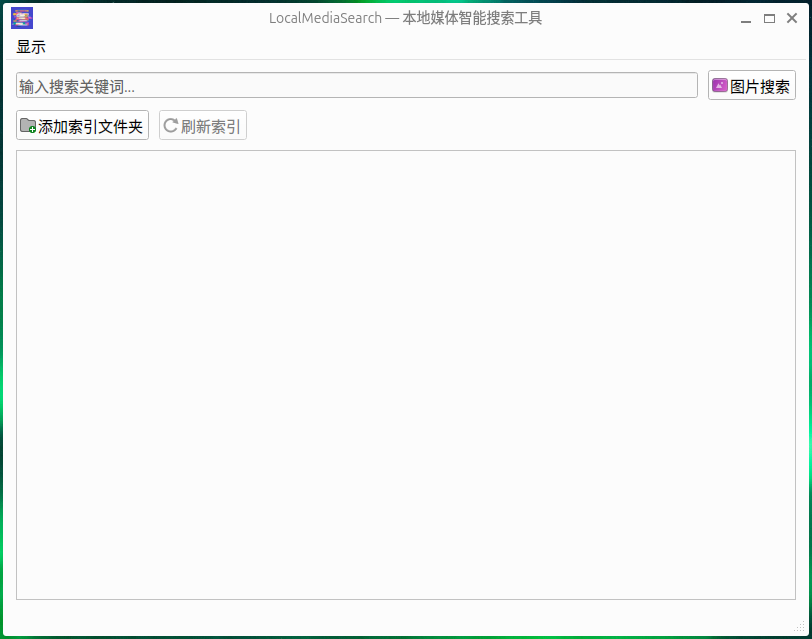
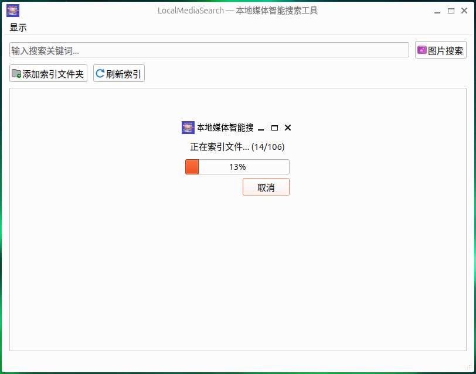
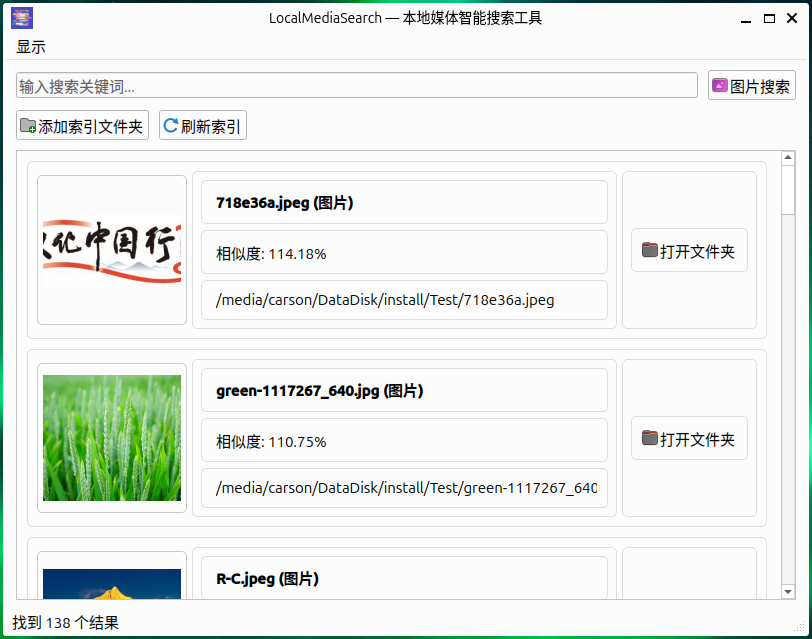

# LocalMediaSearch - Local Media Intelligent Search Tool

## Project Overview
LocalMediaSearch is a cross-platform (Windows, macOS, Linux) local media file search tool that supports searching local images and video files through text (Chinese and English) and images. It uses advanced machine learning models for image recognition and feature extraction, allowing users to easily manage and retrieve local media files. CPU is prioritized for computation, but GPU can be used if CUDA is available.

## Key Features
1. File Indexing
   - Automatic scanning of specified folders
   - Supported image formats: JPG, PNG, GIF, WEBP, BMP, SVG, TIFF
   - Supported video formats: MP4, AVI, MOV, MKV
   
2. Search Capabilities
   - Text Search: Search image and video content through keywords
   - Image Search: Upload images to search for similar content
   
## Technical Solution
- Developed with PyQt6 for cross-platform desktop applications
- Uses ChineseCLIP model for text-image feature extraction
- Uses Chroma for vector search
- SQLite3 for storing file indexes and metadata

## Installation Instructions
1. Environment Requirements
   - Python 3.12+
   - CUDA support (optional, for GPU acceleration)

2. Installation Steps
   ```bash
   # Clone project
   git clone https://gitee.com/kaisen-wang/local-media-search.git
   
   # Create virtual environment
   python -m venv venv
   
   # Activate virtual environment
   source venv/bin/activate
   
   # Install dependencies
   pip install -r requirements.txt
   
   # Run program
   python main.py

   # Build program
   python build.py
   
   # Install UPX compression tool
   ```

## User Guide
1. First Run
   - Click "Add Index Folder" to configure folders to index
   - Wait for system to complete initial indexing
   
     
     

2. Search Operations
   - Text Search: Enter keywords directly in search box
   - Image Search: Click image icon to upload reference image
   - View search results, supports preview and opening original file location

     

## Development Roadmap
- [X] v1.0: Basic search functionality
- [X] v1.1: Added video frame extraction and search
- [X] v1.2: Optimized search algorithm and user interface
- [ ] v2.0: Add more advanced features

## Contribution Guide
We welcome issues and pull requests to help improve the project.

## License
MIT License 

## Model Configuration Instructions

### Model Download and Installation
1. Create model storage directory:
```bash
mkdir -p ./models
```

2. Download model files:
   - Visit [chinese-clip-vit-base-patch16](https://huggingface.co/OFA-Sys/chinese-clip-vit-base-patch16)
   - Download all model files to `./models/chinese-clip-vit-base-patch16` directory
   - Ensure the following essential files are downloaded:
     - config.json
     - pytorch_model.bin
     - clip_cn_vit-b-16.pt

3. Directory structure should be:
```
./models/
└── chinese-clip-vit-base-patch16/
    ├── config.json
    ├── pytorch_model.bin
    └── clip_cn_vit-b-16.pt
```

### FAQ
If encountering "Model file not found" error, please check:
1. Whether model files are correctly downloaded
2. Whether file paths are correct
3. Whether filenames match the configuration
